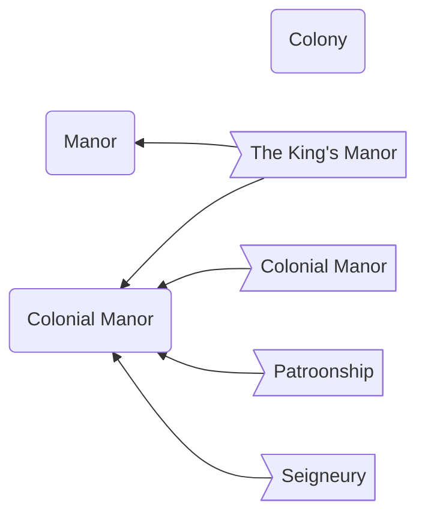

Completely depends on the [[Setting]]

## Colony:

- ?

## Manor:

- The King's Manor

## Colonial Manor:

- Colonial Manor
- [[Setting#Historic Colonial Manors|Patroonship]]
- [[Setting#Historic Colonial Manors|Seigneury]]
- The King's Manor

